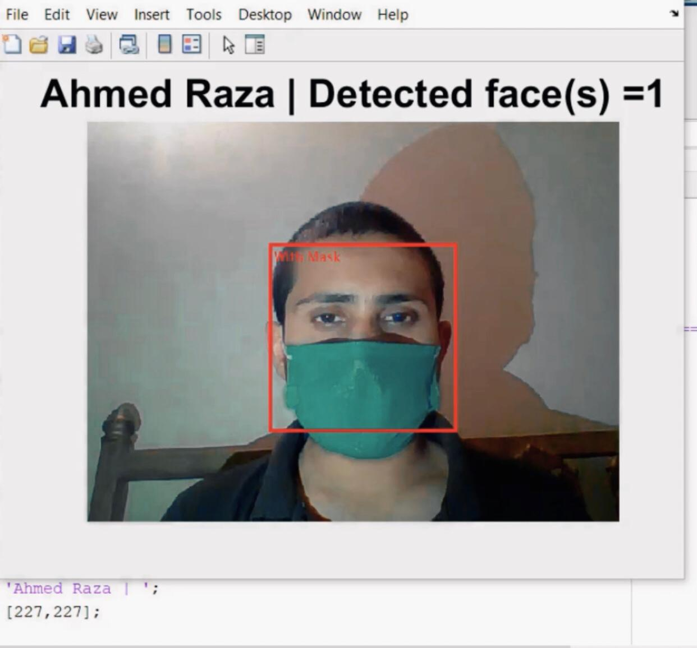

# Live-video-stream-Face-Mask-Detection-using-MATLAB-

The project is the Ongoing effort to deploy Deep Learning Approach to Cater Corona Virus pendemic. I have made an project utilizing Alexnet dataset to identify the people with / without face masks. Moreover, due to GPU specificaions it was all simulated in MATLAB workspace of edition 2019b.

